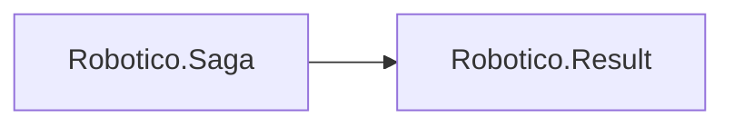

# Robotico.Saga

[](https://dotnet.microsoft.com/download/dotnet/8.0)
[](https://dotnet.microsoft.com/download/dotnet/10.0)
[](https://github.com/robotico-dev/robotico-saga-csharp/packages)

Saga pattern for compensating transactions and cross-service consistency. Orchestration or choreography; Result-based. Depends on Robotico.Result.

## Robotico dependencies



## Installation

```bash
dotnet add package Robotico.Saga
```

## License

See repository license file.
