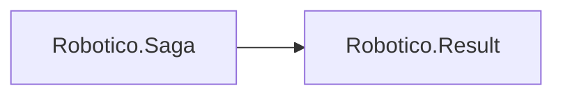

# Robotico.Saga

[](https://github.com/robotico-dev/robotico-saga-csharp/actions/workflows/publish.yml)
[](https://dotnet.microsoft.com/download/dotnet/8.0)
[](https://dotnet.microsoft.com/download/dotnet/10.0)
[](https://github.com/robotico-dev/robotico-saga-csharp/packages)

Saga pattern for compensating transactions and cross-service consistency. Orchestration or choreography; Result-based. Depends on Robotico.Result.

## Robotico dependencies



## Installation

```bash
dotnet add package Robotico.Saga
```

## Quick start

Implement `ISagaStep` (ExecuteAsync + CompensateAsync). Run steps in order; on failure, call CompensateAsync for completed steps in reverse order. See `docs/design.adoc` for orchestration vs choreography.

## Documentation

Design docs (AsciiDoc) are in the `docs/` folder:

- **Design** (`docs/design.adoc`) — Saga pattern, orchestration vs choreography, Execute/Compensate semantics, related packages.
- **Index** (`docs/index.adoc`) — Quick links and how to build the docs.

To build HTML: `asciidoctor docs/index.adoc -o docs/index.html` and `asciidoctor docs/design.adoc -o docs/design.html`.

## Building and testing

```bash
dotnet restore
dotnet build -c Release
dotnet test -c Release --collect:"XPlat Code Coverage"
```

## Related packages

- **Robotico.Repository** — Persist saga state for resumability.
- **Robotico.Resilience** — Retry step execution and compensation.
- **Robotico.Events** — Emit domain events (choreography-style sagas).
- **Robotico.Mediator** — Implement steps as Mediator request handlers.

## License

See repository license file.
